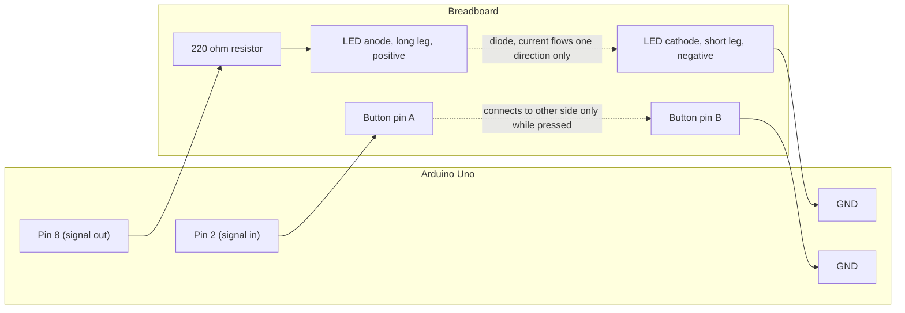

# Mini Reaction Timer


A tiny Arduino build made for fun during a break from my MSc dissertation work. It measures human reaction time using an LED, a push button, and the Arduino's internal clock.

This is a personal side project, not a research study, and not connected to any formal academic work.

---

## Contents

- [The idea](#the-idea)
- [Hardware used](#hardware-used)
- [Wiring](#wiring)
- [How the timing works](#how-the-timing-works)
- [Sample output](#sample-output)
- [Usage](#usage)
- [License](#license)

---

## The idea

The design is loosely inspired by the **Psychomotor Vigilance Task (PVT)**, a real tool used in sleep and attention research. A light turns on after a random, unpredictable delay, the person watching presses a button the instant they notice it, and the gap between those two moments is their reaction time, measured in milliseconds (thousandths of a second).

The wait before the light turns on is randomized on purpose. If it always came after a fixed delay, the brain would start predicting it rather than genuinely reacting to it. Pressing before the light appears counts as a false start, sometimes called an anticipatory response, a guess rather than a real reaction.

---

## Hardware used

| Component | Quantity |
|---|---|
| Arduino Uno | 1 |
| LED | 1 |
| 220 ohm resistor | 1 |
| Push button (tact switch) | 1 |
| Breadboard | 1 |
| Jumper wires | a handful |
| USB cable | 1 |

---

## Wiring

| From | To |
|---|---|
| LED anode (long leg) | 220 ohm resistor, then Arduino pin 8 |
| LED cathode (short leg) | Arduino GND |
| Button pin one | Arduino pin 2 |
| Button pin two | Arduino GND |



The button uses the Arduino's built in pull up resistor (`INPUT_PULLUP`), so no extra resistor is needed for it. The pin reads HIGH normally and drops to LOW the instant it is pressed.

---

## How the timing works

The sketch uses `millis()`, a built in Arduino function that counts milliseconds since the board powered on. The moment the LED turns on, the current millisecond count is stored. The moment the button is pressed, the count is taken again, and the difference between the two is the reaction time.

---

## Sample output

```
Get ready...
Reaction time: 365 ms
Get ready...
Reaction time: 591 ms
Get ready...
Reaction time: 498 ms
Get ready...
Reaction time: 402 ms
Get ready...
Reaction time: 1102 ms
Get ready...
Reaction time: 384 ms
```

That single 1102 ms result stands well outside the rest. In vigilance research, a sudden slow response surrounded by otherwise normal ones is called a **lapse**, a brief drop in attention even while someone is technically awake and paying attention. Catching one in a homemade six sample test is a nice little demonstration of how noisy and human this kind of data really is.

Average reaction time here (excluding the lapse) sits a little above the roughly 200 to 300 ms range typically reported in lab based PVT studies. That gap is expected, this setup measures the full mechanical chain of noticing a light and physically moving a finger onto a breadboard button, not just the neural reaction time itself.

---

## Usage

1. Wire the circuit as described above.
2. Open `reaction_timer.ino` in the Arduino IDE.
3. Select your board and port under the Tools menu, then upload.
4. Open the Serial Monitor, set the baud rate to 9600.
5. Watch the LED, press the button the instant it lights up.

---


